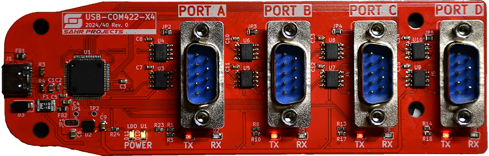
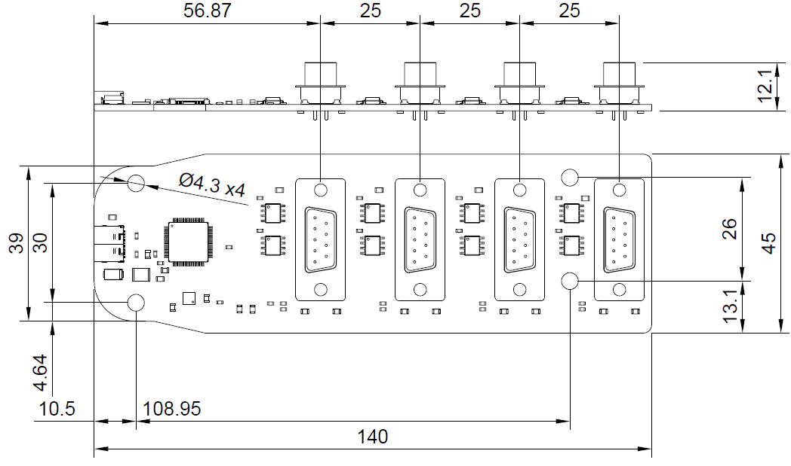

# USBCOM422x4
Simple 4 channel USB to RS422 serial converter module board, based on the XR21B1424 USB UART Bridge.
When connected to a PC four virtual COM ports are available for communication with serial devices.

The board is inspired on a similar RS422 converter, but more robust and with updated functionalities:
* A more modern USB-C connector
* A newer, compact and more robust USB-Serial bridge IC
  * Includes ±15kV ESD on USB lines
  * Internally provides all necessary functionality (48MHz clock, regulator, drivers) which simplifies the design and minimizes component failures.
* A sightly more protected power input using a TVS, a PPTC and an improved LDO.
* Supports USB suspend mode, disabling the transceivers when no USB bus activity is detected.
* Pinout printed on bottom silkscreen. 

## Drivers
The USB Bridge chip can use the native OS CDC-ACM.
However, using the MaxLinear supplied custom drivers is recommended.

Get the latest drivers from their web, under "Documentation & Design Tools":
https://www.maxlinear.com/product/interface/uarts/usb-uarts/xr21b1424

A copy of the drivers used to test the board can be found in the [drivers](drivers) folder.

## Technical details

### Pinout
### USB
Standard 16 pin USB-C connector for use as a USB 2.0 full speed device (MBs).

### RS422 Serial port

Each serial port interface uses a DE-9 male connector.

| Pin | Signal | Direction | Description             |
|-----|-------|-----------|-------------------------|
| 1   | TX-   | O         | Data output, negative   |
| 2   | TX+   | O         | Data output, positive   |
| 3   | RX+   | I         | Data input, positive    |
| 4   | RX-   | I         | Data input, negative    |
| 5   | GND   | -         | Signal ground           |
| 6   | RTS-  | O         | Ready to send, negative |
| 7   | RTS+  | O         | Ready to send, positive |
| 8   | CTS+  | I         | Clear to send, positive |
| 9   | CTS-  | I         | Clear to send, negative |

### HMI

| LED       | Color  | Meaning                                                                                             |
|-----------|--------|-----------------------------------------------------------------------------------------------------|
| POWER LDO | Yellow | On when power is being provided to RS422 transceivers. Should be on when not in suspend mode.       |
| POWER U1  | Yellow | On when USB-UART Bridge chip is powered. Should be always with the USB cable plugged                |
| TX        | Red    | Led toggles at a rate of approximately 10 Hz whenever the corresponding UART transmit pin is active |
| RX        | Green  | Led toggles at a rate of approximately 10 Hz whenever the corresponding UART receive pin is active  |

### Mechanical

Dimensions in mm.

## Design notes

This board currently has not been tested for EMI/EMC compliance. Could generate or be affected by radio interferences.

The design only uses two layers in order to reduce manufacturing costs.
To get a cleaner layout and reduce possible EMI effects the stackup can be increased to 4 layers. 
Also size could be optimized and reduced, the current form factor follows the board I was trying to replace.